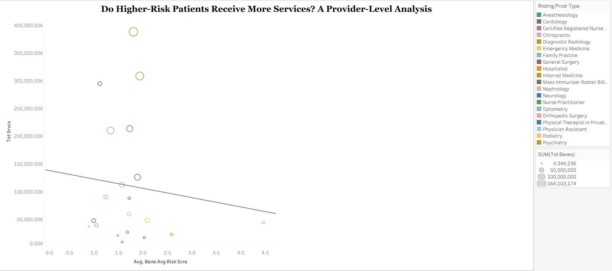
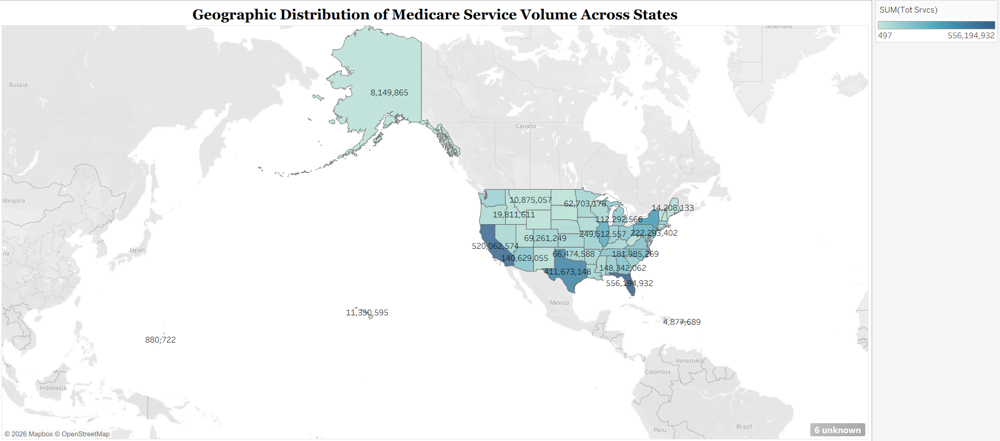

# 🏥 CMS Healthcare Data Analysis: Provider & Geographic Insights (2019–2023)

## 📌 Overview
Built an end-to-end data analytics solution on large-scale CMS Medicare data (~3GB/year) to analyze healthcare service utilization across providers, patient risk levels, and geographic regions.

---

## 🎯 Key Questions
- Do higher-risk patients receive more services?
- How does healthcare usage vary across states?
- Which provider specialties drive the most service volume?

---

## ⚙️ Data Pipeline
Raw CMS Data → Cleaning (Python) → MySQL → SQL Analysis → Tableau Dashboards

---

## 🔧 What I Did
- Cleaned and standardized large multi-table datasets  
- Built SQL queries (joins, aggregations, filtering) for analysis  
- Implemented data quality checks (nulls, duplicates, consistency)  
- Designed Tableau dashboards for business insights  

---

## 📊 Key Insights
- **Weak correlation** between patient risk score and services → potential inefficiencies  
- **High service volume** in states like Florida, Texas, California  
- **Top specialties**: Clinical Labs, Internal Medicine → major contributors  

---

## 📈 Dashboards

### Risk vs Services

### Geographic Distribution

### Provider Specialties

---

## 🛠️ Tech Stack
Python (Pandas), SQL (MySQL), Tableau  

---

## 💡 Impact
Demonstrates ability to work with large datasets, ensure data quality, and translate data into actionable business insights.

---
